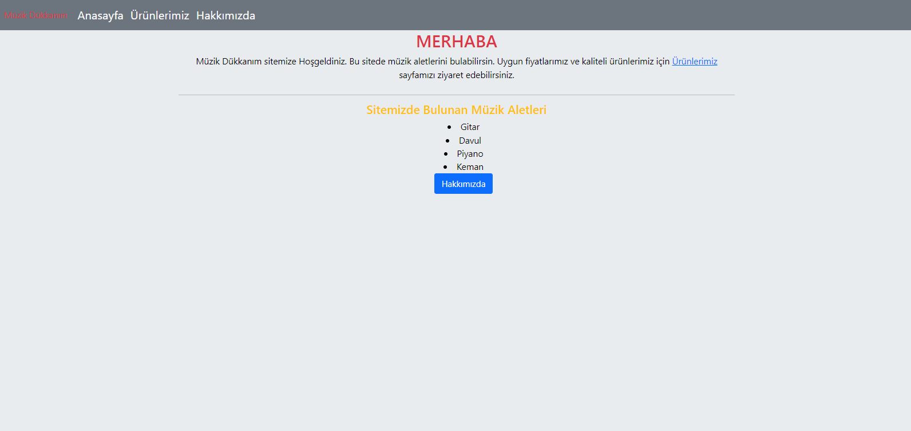
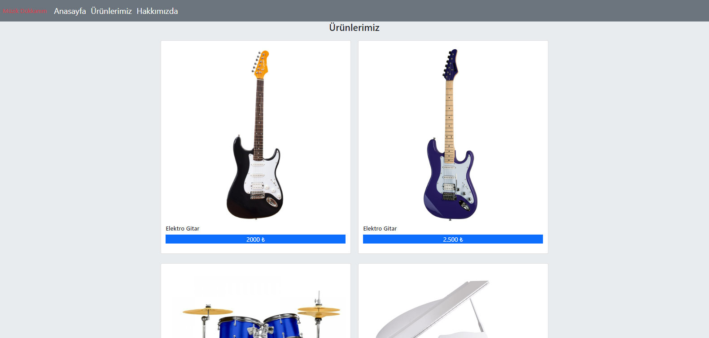
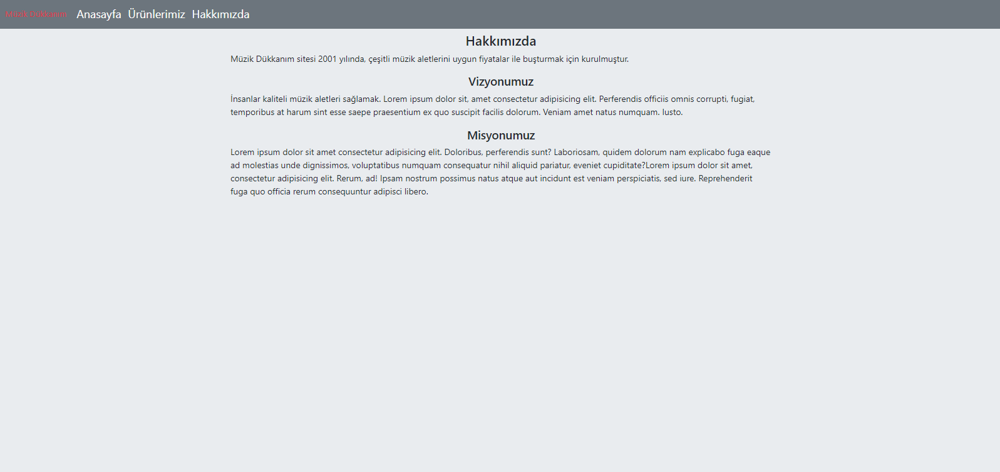

# Bootstrap - Ödev1 - İlk Web Sayfası
  Daha önce CSS dersleri için oluşturulmuş olan web sayfasını Bootstrap ile tekrar oluşturduk. Web sayafasın 3 farklı sayfadan oluşmaktadır:
 - Anasayfa- giriş sayfamız ve genel bilgilerin olduğu sayfadır. Web sayfasının amacının içerisinde neler bulunduğunun kısa bir tanıtımı bulunmakta.Buraya grid sistemi ve bootstrap ile bir navbar eklendi.
 - Ürünlerimiz - sayfa içerisinde satışta olan ürünler listelenmekte ayrıca ürünlerin resimleri ve fiyatları bulunmaktadır. Bu sayfamıza, grid sistemi ve içersine Card kullanılarak ürünler bu kartlar içerisine yerleştirildi ve bootstrap ile bir navbar eklendi.
 - Hakkımızda - sayfa içerisinde vizyon , misyon gibi bölümler bulunmaktadır ve site hakkında bilgilerin yer aldığı bölümdür. 
Bu sayfaya, grid sistemi ve bootstrap ile bir navbar eklendi.

İçerik HTML, CSS ve Bootstrap 5.1 versiyonu ile oluşturulmuştur. Bootstrap sayfaya CDN olrak eklendi. Bootstrap ile sayfalar içerisine Navbar, Grid ve Card sistemleri dahil edildi. Sayfaların resimlerini aşağıda görebilirsiniz.

 
 
 