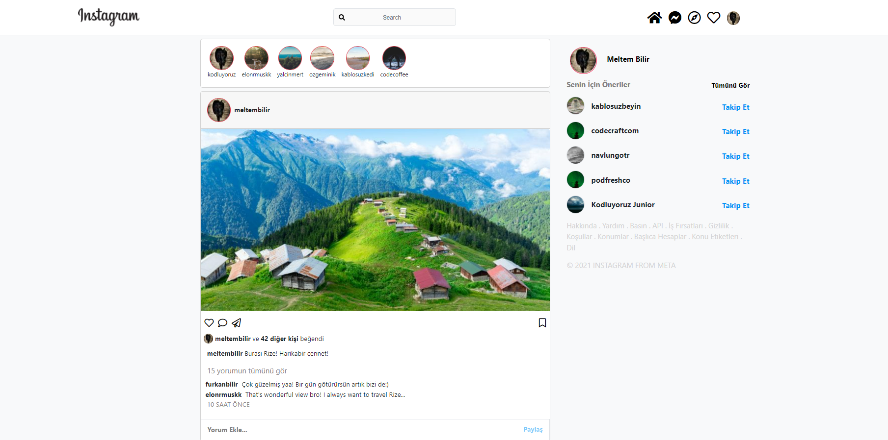
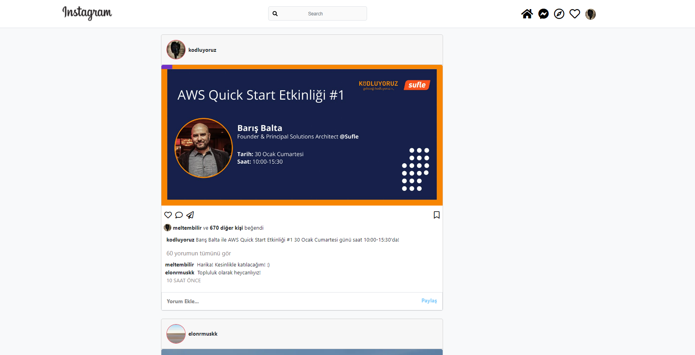

# Bootstrap - Ödev2 - Instagram Clone Sayfası
Bir sosyal medya platformu olan Instagram' ın Bootstrap kullanılarak oluşturulmuş anasayfası tasarımıdır.
Sayfa içerisinde navbar bölümümüz başa sabitlendi. Ayrıca sayfamız iki sütundan oluşuyor.
Sayfa içerisnde post, story ve sağ bölümde önerilenler kısımları bulunmaktadır.

İçerik HTML, CSS ve Bootstrap 5.2 versiyonu ile oluşturulmuştur. Bootstrap sayfaya CDN olrak eklendi. Bootstrap ile sayfalar içerisine Navbar, Grid ve Card sistemleri dahil edildi. Sayfaların resimlerini aşağıda görebilirsiniz.

 
 
