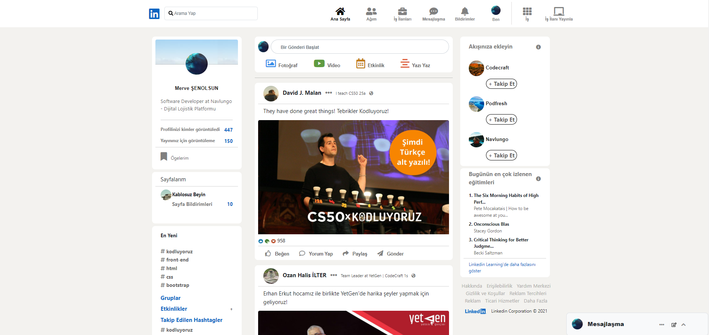
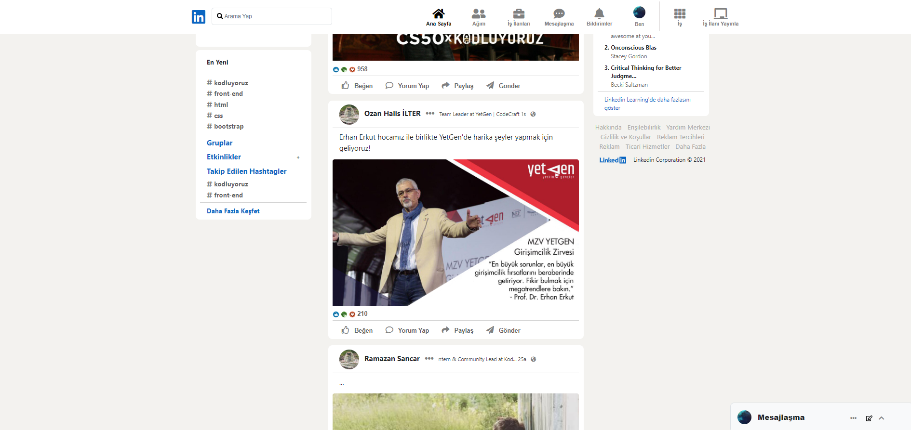

# Bootstrap - Ödev3 - Linkedin Clone Sayfası
Bir profesyonel sosyal iş ağı ve sosyal paylaşım platformu olan LinkedIn' ın Bootstrap kullanılarak oluşturulmuş anasayfası tasarımıdır.
Sayfa içerisinde navbar bölümümüz başa sabitlendi. Ayrıca sayfamız üç sütundan oluşuyor.
Sayfa içerisinde; 
- sol bölüm; kişi, profil ve yayın görüntülenmeleri, ögeler, sayfalar ve hashtaglar,  
- orta bölüm; gönderi paylaşma, gönderiler, beğeni ve yorumlar,
- sağ bölümde ise; önerilenler, izlenenler, yardım destek gibi kısımlar bulunmaktadır.

İçerik HTML, CSS ve Bootstrap 5.2 versiyonu ile oluşturulmuştur. Bootstrap sayfaya CDN olrak eklendi. Bootstrap ile sayfalar içerisine Navbar, Grid ve Card sistemleri dahil edildi. Sayfaların resimlerini aşağıda görebilirsiniz.

 
 