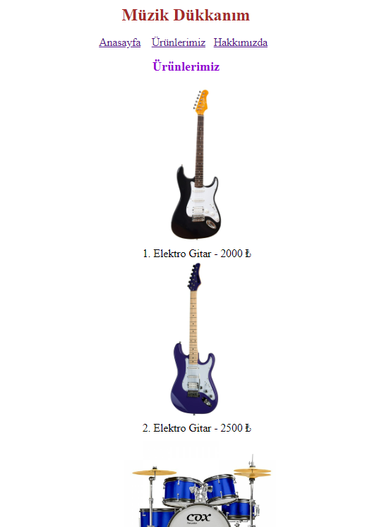

# CSS - Ödev1 - İlk Web Sayfamızı Oluşturmak
 CSS dersleri için oluşturulmuş ilk ödev. Web sayafası 3 farklı sayfadan oluşmaktadır:
 - Anasayfa- giriş sayfamız ve genel bilgilerin olduğu sayfadır. Web sayfasının amacının içerisinde neler bulunduğunun kısa bir tanıtımı bulunmakta.
 - Ürünlerimiz - sayfa içerisinde satışta olan ürünler listelenmekte ayrıca ürünlerin resimleri ve fiyatları bulunmaktadır.
 - Hakkımızda - sayfa içerisinde vizyon , misyon gibi bölümler bulunmaktadır ve site hakkında bilgilerin yer aldığı bölümdür. 

İçerik HTML ve CSS ile oluşturulmuştur. CSS ile sayafaya renk, yazı tipi, yazı boyutu, yazı ve resimleri ortalama gibi özellikler eklenmiştir. Sayfaların resimlerini aşağıda görebilirsiniz.

 
 
 