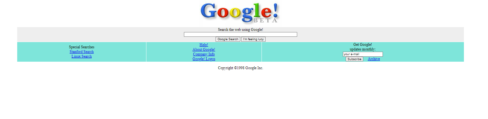

# CSS - Ödev2 - Google 1998 
 CSS dersleri için oluşturulmuş ikinci ödev. Sayfa, Google' ın ilk versiyonu olan 1998 sayfasının  clonu olrak tasarlanmıştır. Genel görünüm Tablo yapısı ile oluşturulmuştur. İçerisinde linkler ve küçük bir form bölümü bulunmaktadır. Fakat form bölümü işlevsel değildir sadece görsel olarak oluşturulmuştur.

İçerik HTML ve CSS ile oluşturulmuştur. CSS ile sayafaya renk, , yazı ve resimleri ortalama gibi özellikler eklenmiştir. Sayfanın resmini aşağıda görebilirsiniz.

 