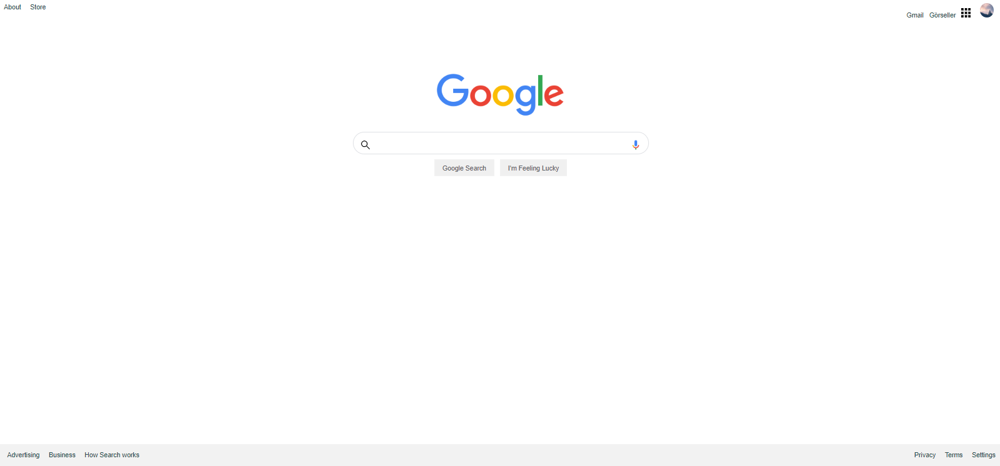

# CSS - Ödev3 - Google Anasayfası 
 CSS dersleri için oluşturulmuş üçüncü ödev. Sayfa, Google' ın anasayfasının  clonu olarak tasarlanmıştır. Genel görünüm 3 ana yapıdan oluşmaktadır:
 - Header bölümü, sayfanın üst kısmı kullanıcının resminin, gmail gibi diğer ürünlere ulaşabileceği linklerin bulunduğu bölüm. 
 - Section Bölümü orta kısım google losu arama yaptığımız bölüm ve altındaki butonları içerisinde bulunduruyor. 
 - Footor bölümü sayfanın en altında bulunan linklere ulaşmamızı sağlayan bölüm. 
 
 İçerisinde bulunan form bölümü işlevsel değildir, sadece görsel olarak oluşturulmuştur.

İçerik HTML ve CSS ile oluşturulmuştur. CSS ile sayafaya renk, yazı tipi ve boyutu, yazı ve resimleri ortalama, margin, padding gibi özellikler eklenmiştir. Ayrıca arama bölümü CSS ile oluşturulmuştur. Sayfanın resmini aşağıda görebilirsiniz.

 