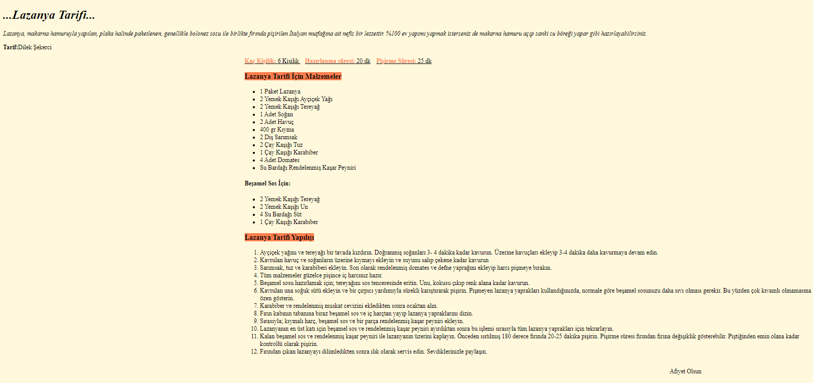

# HTML - Ödev1 - İlk Web Sayfamızı Oluşturmak
 HTML dersleri için oluşturulmuş üçüncü ödev. Sayfa başlık ve tarifin bulunduğu 2 ana bölümden oluşuyor. Giriş kısmında tarifin kısa bir tanıtımı ve alt kısımda gerekli malzemelerin yer aldığı bölüm yer almakta. Son kısımda da tarifin nasıl yapılacağı adım adım anlatılmaktadır. İçerik HTML ile oluşturulmuştur, ayrıca inline olarak bir kaç noktada renk ve girinti ayarları için CSS eklenmiştir. Sayfanın resmini aşağıda görebilirsiniz.

 