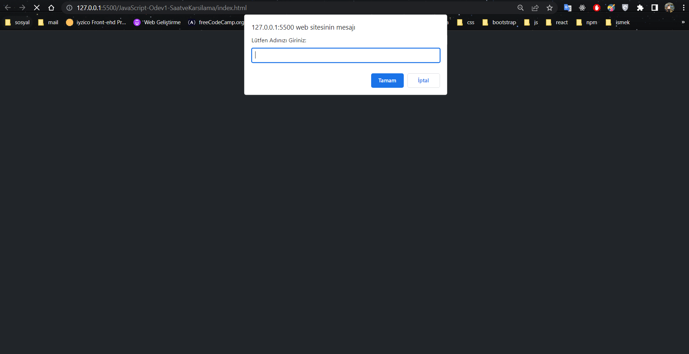
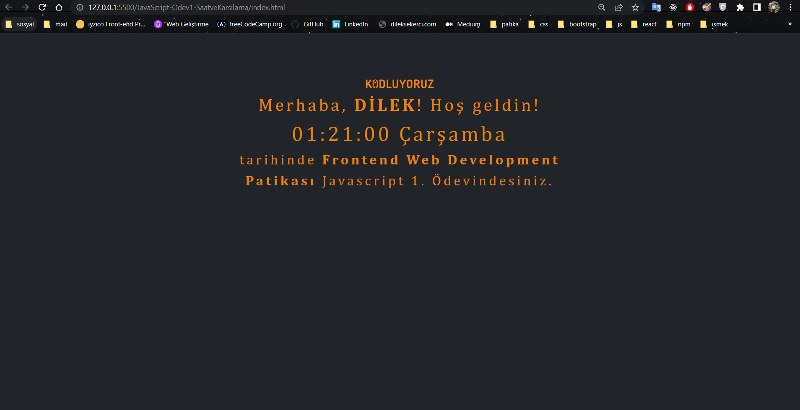

# Bootstrap - Ödev1 - Saat ve Karşılama Sayfası
Sayfamız açılışta pop up ile ismimizi girmemizi istiyor ve bu ismi daha sonra javascript ile buradan gelen verileri sayfaya ekliyoruz.
Ayrıca sayfamız içerisinde o günün tarihi ve saati görünmektedir. Bu tarih ve saat verilerini javascript fonsiyonu ile oluşturarak sayfamıza ekledik.

İçerik HTML, CSS, Bootstrap 5.2 versiyonu ve JavaScript ile oluşturulmuştur. Bootstrap sayfaya CDN olrak eklendi. Sayfaların resimlerini aşağıda görebilirsiniz.

 
 