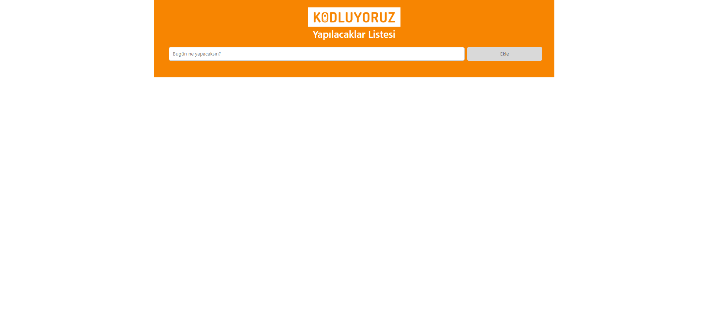
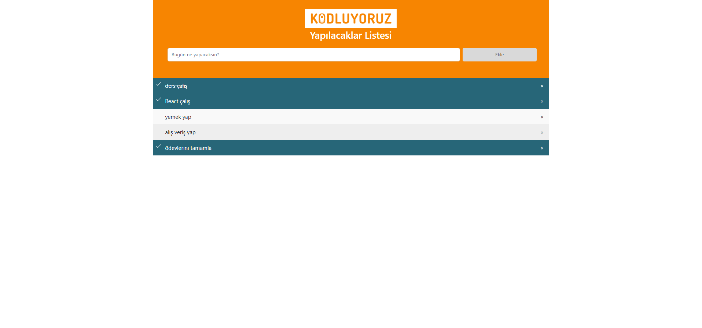
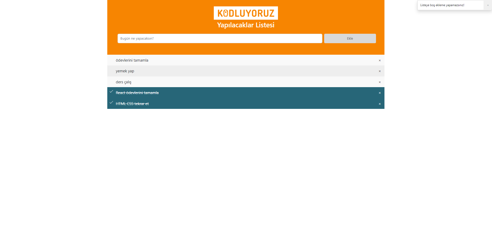

# JavaScript - Ödev2 - ToDo List
Sayfamız, yapılacakları kaydetdiğimiz bir listeleme sayfası. Sayfa içerisinde, listeye yeni bir yapılacak iş eklenebilir, silinebilir ve yapılanların üzerine tıklanarak işaretlenebilir durumda. Ayrıca boş ekleme yapılamaz, listeye eklendi ve silindi mesajları Bootstrap Toast ile gösterilmektedir.

Listeye eklenen veriler Local Storage da tutuluyor ve daha sonra açtığımızda, yapılacak listemize daha önce eklediğimiz ve seçtiğimiz yani tamamladığımız işleri görebiliyoruz. 

İçerik HTML, CSS, Bootstrap 5.2 versiyonu ve JavaScript ile oluşturulmuştur. Bootstrap sayfaya CDN olarak eklendi. Sayfaların resimlerini aşağıda görebilirsiniz.

 
 
 
 