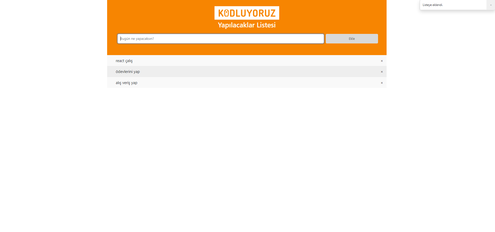

# JavaScript - Ödev2 - ToDo List
Sayfamız, yapılacakları kaydetdiğimiz bir listeleme sayfası. Sayfa içerisinde, listeye yeni bir yapılacak iş eklenebilir, silinebilir ve yapılanların üzerine tıklanarak işaretlenebilir durumda. Ayrıca boş ekleme yapılamaz, listeye eklendi ve silindi mesajları Bootstrap Toast ile gösterilmektedir.

Dizi olarak verilen yemeklerde; id,  title, category, price, img ve desc bölümleri bulunmakta. Filtreleme yaparken category bölümüne göre filtreleyerek ilgili alana ekledik.

İçerik HTML, CSS, Bootstrap 5 versiyonu ve JavaScript ile oluşturulmuştur. Bootstrap sayfaya CDN olrak eklendi. Sayfaların resimlerini aşağıda görebilirsiniz.

 
 
 
 