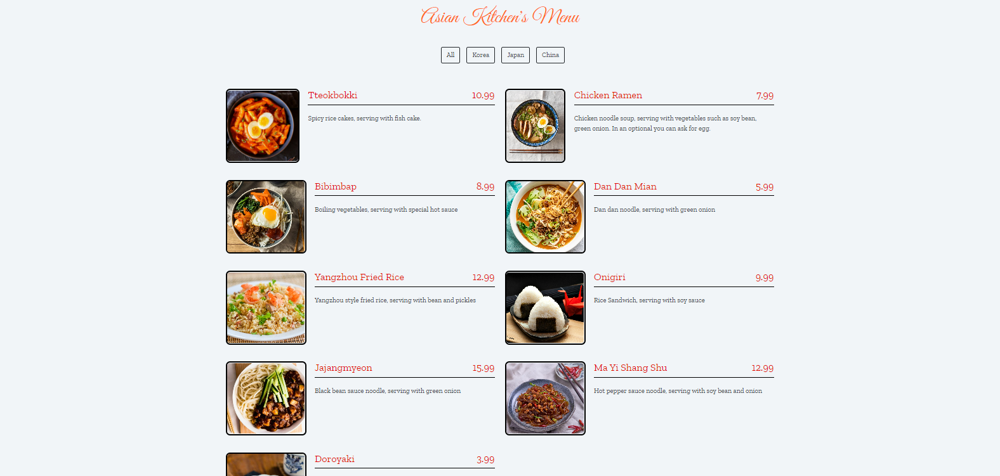
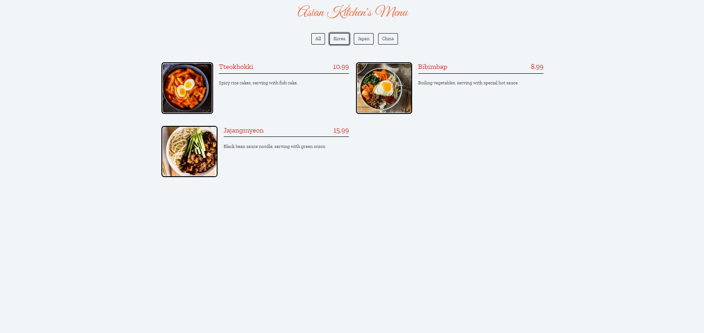
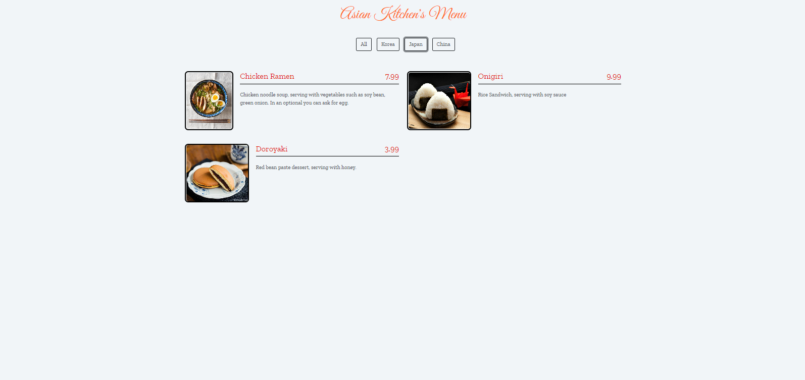
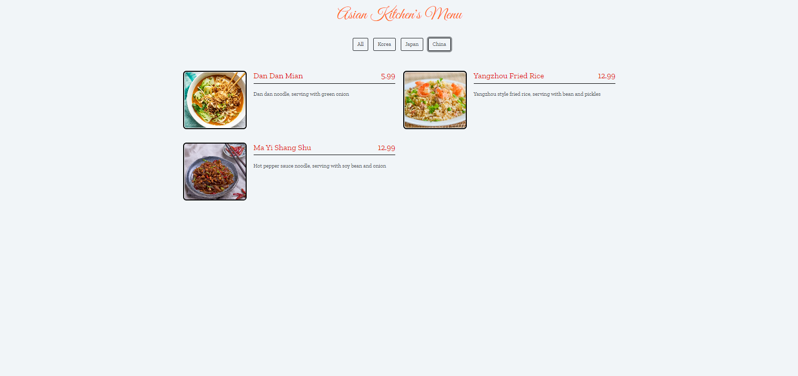

# JavaScript - Ödev3 - Asian Kitchen's Menu
Sayfamız, 4 kategoriden oluşuyor. Tüm yiyeceklerin göründüğü, kore yemeklerinin filtrelendiği, japon yemeklerinin filtrelendiği ve çin yemeklerinin filtrelendiği bölümler bulunuyor.

Dizi olarak verilen yemeklerde; id,  title, category, price, img ve desc bölümleri bulunmakta. Filtreleme yaparken category bölümüne göre filtreleyerek ilgili alana ekledik.

İçerik HTML, CSS, Bootstrap 5 versiyonu ve JavaScript ile oluşturulmuştur. Bootstrap sayfaya CDN olrak eklendi. Sayfaların resimlerini aşağıda görebilirsiniz.

 
 
 
 